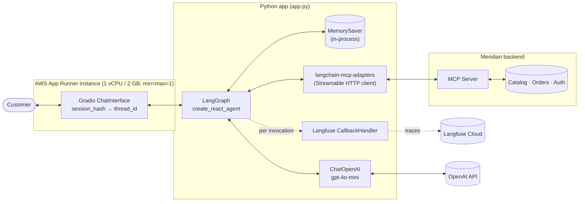
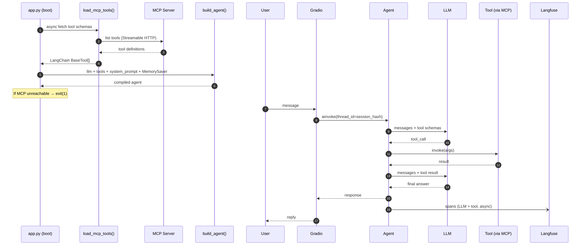
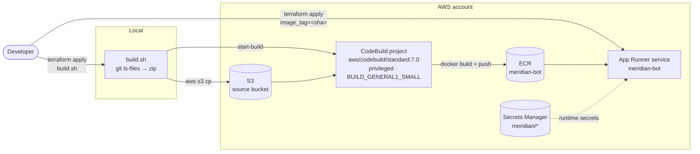
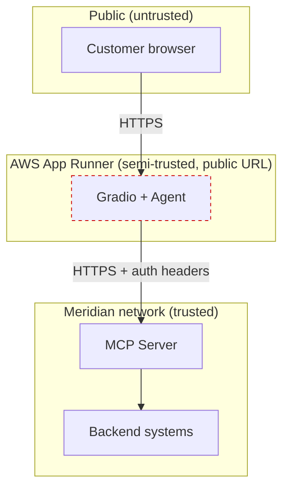

# Architecture

## Runtime flow

## Startup vs. per-turn

## Key invariants

- **Async end-to-end** — no sync/async mixing
- **Tools loaded once** at startup; never re-fetched per turn
- **One static system prompt** (~400 tokens) — no per-turn dynamic content
- **`thread_id = gr.Request.session_hash`** — `MemorySaver` owns history
- **Auth is MCP-side** — bot trusts the server to enforce it
- **Logs never contain tool args or results** (PII)

## Deploy pipeline (AWS App Runner)

Three phases per deploy: targeted `terraform apply` for the AWS skeleton (one-time), `build.sh` for image build (~80s), full `terraform apply` to roll the service forward (~3 min).

## Trust boundaries

Dashed border on the App Runner box marks the **production gaps** documented in `CLAUDE.md`: no bot-side auth, no rate limiting, in-process session store (pinned `min=max=1` to compensate), Langfuse PII redaction unresolved.
